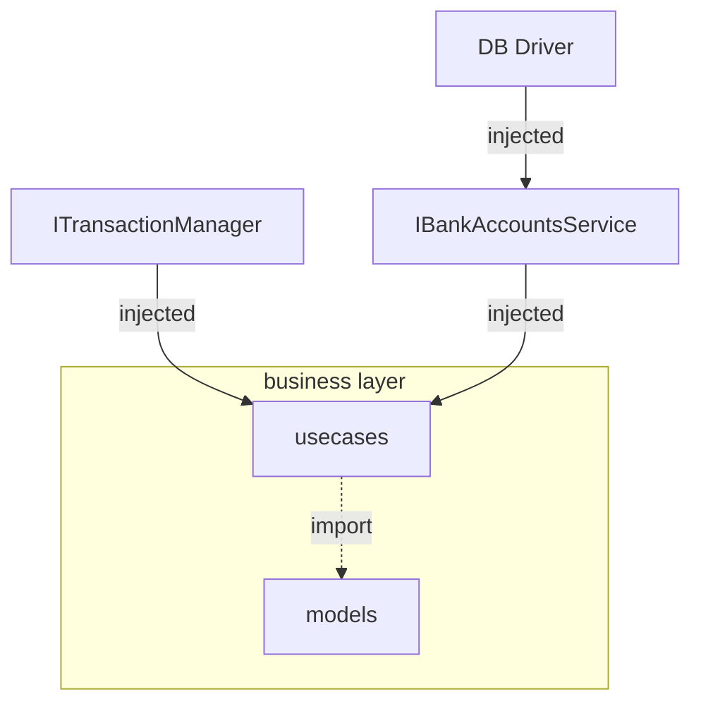
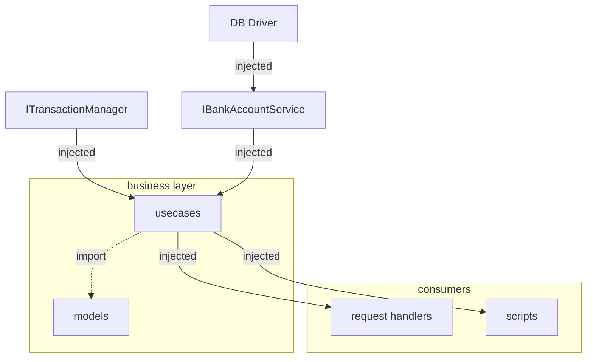

# Dependency Injection example

This is the application of the [following article]()

It uses the DI container defined in the article. An injectable (service) registers itself to the manifest using a convention:
any file with the ``.service.js`` extension will be injectable. For example a file called ``bank-accounts.service.js`` will be injectable under the token ``BankAccounts``.  

The DI container is used in the context of a web server (built with the [Fastify framework](https://www.fastify.io/)) with one route which simulates a money transfert between two accounts. Once you have started the server you can run the following curl command:

```shell
curl -X POST --location "http://localhost:3005/transferts/" \
-H "Content-Type: application/json" \
-d "{
\"from\": 1,
\"to\": 2,
\"amount\": 30
}"
```

This will move 30(euros) from bank account 1 to bank account 2. 
The action is done within an atomic transaction, and there is a constraint over the balance field: if the balance of the debited account get lower than zero the transaction is aborted.

The DI container does not have to be used with any particular framework. To show the point there is a script which uses the DI container and let you check the balance of any bank account. For example, you can run: 

``npm run check-balance -- 1 2``

and you will see the balance for account 1 and account 2

## Getting started

### databases

The beauty of DI is that it allows us to swap concrete implementations. In this case it gives the ability to change entirely the DB engine without touching the "business" code: the ```.models.js``` files and, the route handlers and scripts ("usecases").

We provided various implementations of the abstract interfaces: for MySQL and PostgresSQL (the only difference is the low level DB pool impl), and for mongodb (with a different bankAccounts service impl and a different db pool impl )

To toggle a particular engine: use the ``DB_ENGINE`` en variable (mongo, mysql or pg (default))

#### SQL databases

You can start un local dev database with docker-compose:

``docker-compose up -d db``

This will start a postgres container and a mysql container with the schema already set and a data seed (two bank accounts with an initial balance of 100 euros)

#### Mongo database

In order to support "transactions", the mongo set up needs to support replica sets.

1. make sure db-dev/rs-init.sh and db-dev/init.js are executable (``chmod +x path/to/file``) as there will be in a shared volume
2. start the mongo stack ``docker-compose -f mongo-rs.yml up``
3. once you see in the logs that the first node is waiting for the replica set to be initialized, you can run ``docker exec mongo1 /scripts/rs-init.sh``

That's it: you will have a mongo cluster with the ``bank_accounts`` collection created and seeded. Note there are validation constraints as for the SQL databases setups 

### server

simply run ``npm dev``

You should now be able to send request with the aforementioned curl command

### script

If you want to check the balance of account 1 and account 2:

``npm run check-balance -- 1 2``

## overall architecture



The business layer should reamain agnostic of database details:
1. It can import models: pure fonctions which compute the various entity states
2. It get injected an implementation of the high level IBankAccounts interface and an implementation of the ITransactionManager interface

Note the "usecases" are implemented within the route handlers and the scripts themselve. Sometimes it is better not to mix the HTTP related concepts with the actual business usecases: in this case you should add an extra layer:



However, as it adds an extra layer, you need to map the business errors to http codes etc, improving the separation of conerns but at the price of a more complictated "plumbing"

### IBankAccounts

A high level API to update the bank account resources:

```Typescript
type BankAccount = { bankAccountId: number; balance: number };

export interface IBankAccountsService {
  findOne({
    bankAccountId,
  }: {
    bankAccountId: number;
  }): Promise<BankAccount | undefined>;
  updateBalance({
    bankAccountId,
    balance,
  }: {
    bankAccountId: number;
    balance: number;
  }): Promise<void>;
}
```

Note: there is no database details in the interface

### ITransactionManager

```Typescript
export interface ITransactionManager<Client> {
  withinTransaction<Result>(
    fn: ({ client }: { client: Client }) => Promise<Result>
  ): Result;
}
```

Encapsulate the "ACID" concepts sometimes required for a business: it does not have to be tied to storage DB, but in practice it often relies on the storage database technology (In this repository for instance, the DB clients implement this interface without adding an extra indirection point: we could have an abstract TransactionManager.service.js which itselfs depends on a DB client)
